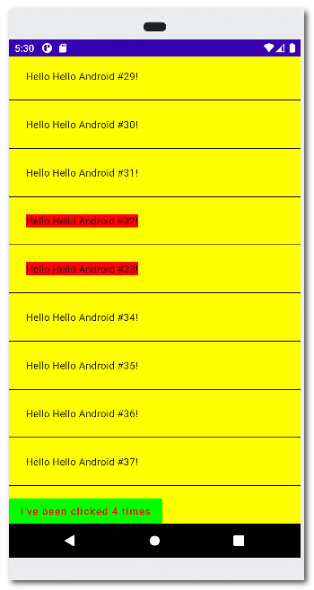
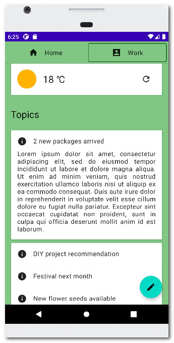
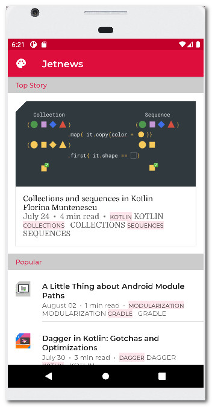
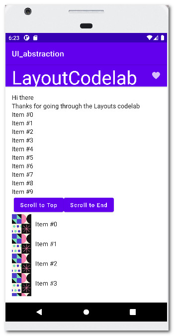
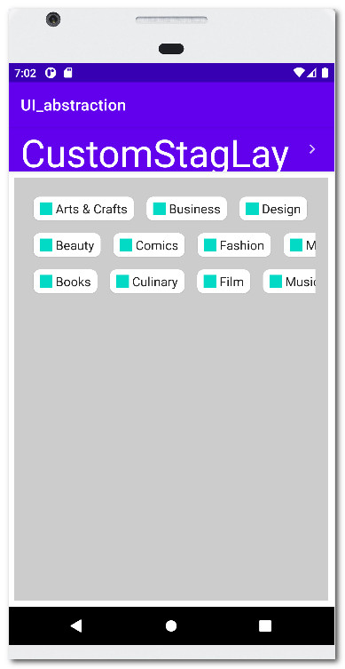
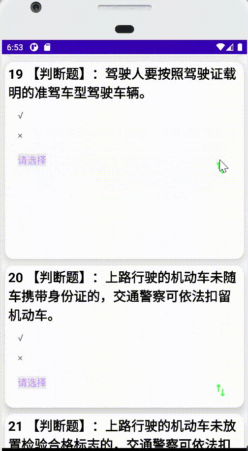
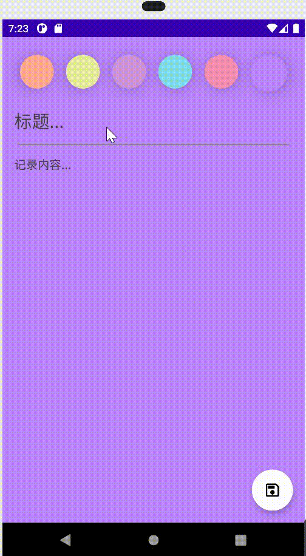
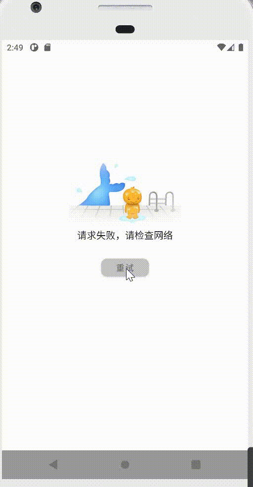

# UseCompose
first  study in Jetpack Compose

### 案例展示

| app                                                          | AnimationCodelab                                             | ThemingCodelab                                               |
| ------------------------------------------------------------ | ------------------------------------------------------------ | ------------------------------------------------------------ |
|  |  |  |
| 简单LazyColumn + animateColorAsState                         | LazyColumn+AnimatedVisibility+HomeTab                        | MaterialTheme+TopAppBar+Card+LazyColumn                      |


| ui_abstraction                                           | ui_abstraction                                               |      |
| -------------------------------------------------------- | ------------------------------------------------------------ | ---- |
|  |  |      |
| 基本的LazyColumn  / ConstraintLayout / StaggeredGrid /   | 自定义Layout                                                 |      |


| DriverExamPaging                                             | CleanArchitecture                                            |      |
| ------------------------------------------------------------ | ------------------------------------------------------------ | ---- |
|  |  |      |
| Paging3+ MVVM + compose+retrofit+LazyColumn                  | dagger:hilt+navigation+room+compose+mvvm+                    |      |


### Paging3分页加载

    1. 引入依赖：
      ```groovy
      //Paging 3.0
      implementation 'androidx.paging:paging-compose:1.0.0-alpha14'
      implementation "androidx.paging:paging-runtime-ktx:3.1.0-rc01"
      ```
    2. Paging实现分页加载，简单快捷可定制，内部管理了分页逻辑和异常处理，而分页规则需要自己定义。主要代码：

      ```kotlin

      class ExamSource(private val repository: Repository) : PagingSource<Int, Question>() {

          private val TAG = "--ExamSource"

          override fun getRefreshKey(state: PagingState<Int, Question>): Int? {
              return null
          }

          override suspend fun load(params: LoadParams<Int>): LoadResult<Int, Question> {

              return try {
                  val currentPage = params.key ?: 1
                  val pageSize = params.loadSize
                  Log.d(TAG, "currentPage: $currentPage")
                  Log.d(TAG, "pageSize: $pageSize")

                  // 传入当前页码，每页大小，然后请求数据。网络请求封装在repository
                  val responseList = repository.getExamList(currentPage, pageSize = pageSize)
                      .result?.resultData?.questionList ?: emptyList<Question>()

                  // 加载分页
                  val everyPageSize = 4
                  val initPageSize = 8
                  // 前一页
                  val preKey = if (currentPage == 1) null else currentPage.minus(1)
                  // 下一页
                  var nextKey: Int? = if (currentPage == 1) {
                      initPageSize / everyPageSize
                  } else {
                      currentPage.plus(1)
                  }
                  Log.d(TAG, "preKey: $preKey")
                  Log.d(TAG, "nextKey: $nextKey")
                  if (responseList.isEmpty()) {
                      nextKey = null
                  }
                  Log.d(TAG, "final nextKey: $nextKey")

                  LoadResult.Page(
                      data = responseList,
                      prevKey = preKey,
                      nextKey = nextKey
                  )
              } catch (e: Exception) {
                  e.printStackTrace()
                  LoadResult.Error(e)
              }
          }
      }
      ```


### 沉浸式状态栏

  ```groovy
  // 状态栏相关
  implementation "com.google.accompanist:accompanist-insets:0.21.2-beta"
  implementation "com.google.accompanist:accompanist-insets-ui:0.21.2-beta"
  implementation "com.google.accompanist:accompanist-systemuicontroller:0.21.2-beta"
  ```

  * `WindowCompat.setDecorFitsSystemWindows(window, true)`

    ```java
    /**
    * 设置decorView是否适配windowsetscompat的WindowInsetsCompat根视图。
    * 若置为false，将不适配内容视图的insets，只会适配内容视图。
    * 请注意:在应用程序中使用View.setSystemUiVisibility(int) API可能会与此方法冲突。应停止使用View.setSystemUiVisibility(int)。
    */
    public static void setDecorFitsSystemWindows(@NonNull Window window,
                final boolean decorFitsSystemWindows) {
            if (Build.VERSION.SDK_INT >= 30) {
                Impl30.setDecorFitsSystemWindows(window, decorFitsSystemWindows);
            } else if (Build.VERSION.SDK_INT >= 16) {
                Impl16.setDecorFitsSystemWindows(window, decorFitsSystemWindows);
            }
        }
    ```

    * 状态栏透明
     拿到SystemUiController的setStatusBarColor()方法来改变状态栏，也可以修改底部导航栏

    ```kotlin
     setContent {
          UseComposeTheme {
               // 状态栏改为透明，参数：color(状态栏颜色)，darkIcons（是否为深色图标）
                rememberSystemUiController().setStatusBarColor(
                      Color.Transparent, darkIcons = MaterialTheme.colors.isLight
                )

                // 底部导航栏颜色
                rememberSystemUiController().setNavigationBarColor(
                     Color.Transparent, darkIcons = MaterialTheme.colors.isLight
                )

                // ...
          }
     }
    ```
    * 调整以适配状态栏高度

    需要用到ProvideWindowInsets，在显示内容的外围包一层ProvideWindowInsets，在Theme以下包裹ProvideWindowInsets以便取得状态栏的高度。

    ```kotlin
     setContent {
          UseComposeTheme {
                     // 加入ProvideWindowInsets
                     ProvideWindowInsets {
                         // 状态栏改为透明
                         rememberSystemUiController().setStatusBarColor(
                             Color.Transparent, darkIcons = MaterialTheme.colors.isLight
                         )

                         Surface(color = MaterialTheme.colors.background) {
                             Scaffold(
                                 modifier = Modifier.fillMaxSize()
                             ) {
                                 Column {
                                       // 填充留白状态栏高度
                                      Spacer(modifier = Modifier
                                          .statusBarsHeight()
                                          .fillMaxWidth()
                                      )

                                      // 你的业务 Composable
                                 )
                             }
                         }
                     }
                 }
          }
    ```

    * 效果

    | 修改前                                                       | FitsSystemWindows :false                                     | 修改颜色                                                     | 适配高度                                                     |
    | ------------------------------------------------------------ | ------------------------------------------------------------ | ------------------------------------------------------------ | ------------------------------------------------------------ |
    |  |  |  |  |


### 下拉刷新

 构建错误：是com.google.accompanist:accompanist:xxx 相关库的版本不兼容，需要依赖相同的版本

```shell
   21:35:51.503 7789-7789/com.jesen.driverexampaging E/AndroidRuntime: FATAL EXCEPTION: main
       Process: com.jesen.driverexampaging, PID: 7789
       java.lang.NoSuchMethodError: No interface method startReplaceableGroup(ILjava/lang/String;)V in class Landroidx/compose/runtime/Composer; or its super classes (declaration of 'androidx.compose.runtime.Composer' appears in /data/app/~~4FT0iYbXWuoHva-X3Y0lBg==/com.jesen.driverexampaging-4uB2hZ7cDclbzM5qgmkttA==/base.apk)
           at com.google.accompanist.swiperefresh.SwipeRefreshKt.rememberSwipeRefreshState(Unknown Source:5)
           at com.jesen.driverexampaging.common.SwipeRefreshListKt.SwipeRefreshList(SwipeRefreshList.kt:31)
           at com.jesen.driverexampaging.ui.composeview.RefreshExamListScreenKt.RefreshExamListScreen(RefreshExamListScreen.kt:33)
           at com.jesen.driverexampaging.Main2Activity$onCreate$1$1$1$1$1.invoke(Main2Activity.kt:54)
           at com.jesen.driverexampaging.Main2Activity$onCreate$1$1$1$1$1.invoke(Main2Activity.kt:47)
           at androidx.compose.runtime.internal.ComposableLambdaImpl.invoke(ComposableLambda.jvm.kt:116)
           at androidx.compose.runtime.internal.ComposableLambdaImpl.invoke(ComposableLambda.jvm.kt:34)
           at androidx.compose.material.ScaffoldKt$ScaffoldLayout$1$1$1$bodyContentPlaceables$1.invoke(Scaffold.kt:316)
           at androidx.compose.material.ScaffoldKt$ScaffoldLayout$1$1$1$bodyContentPlaceables$1.invoke(Scaffold.kt:314)
```
   1. 效果 ：
   

   2. 基本用法：

      * 接入依赖：
        ```groovy
        // 下拉刷新
            implementation "com.google.accompanist:accompanist-swiperefresh:0.21.2-beta"
        ```

      * 设置下拉刷新加载更多并判断状态

        ```kotlin
        @Composable
        fun refreshLoadUse(viewModel: ExamViewModel) {
            // Swipe 的状态
            val refreshState = rememberSwipeRefreshState(isRefreshing = false)
            val collectAsLazyPagingItems = viewModel.examList.collectAsLazyPagingItems()

            SwipeRefresh(state = refreshState, onRefresh = {
                collectAsLazyPagingItems.refresh()
            }) {
                LazyColumn(
                    modifier = Modifier
                        .fillMaxWidth()
                        .fillMaxHeight(),
                    content = {
                        itemsIndexed(collectAsLazyPagingItems) { _, refreshData ->//每个item的展示
                            Box(
                                modifier = Modifier
                                    .padding(horizontal = 14.dp, vertical = 4.dp)
                                    .fillMaxWidth()
                                    .height(50.dp)
                                    .background(Color.Green, shape = RoundedCornerShape(8.dp))
                                    .border(
                                        width = 1.dp,
                                        color = Color.Red,
                                        shape = RoundedCornerShape(8.dp)
                                    )
                                    .padding(start = 10.dp),
                                contentAlignment = Alignment.CenterStart
                            ) {
                                Text(text = refreshData?.data ?: "")
                            }
                        }
                        // append 标识非第一页，也就是指下一页或加载更多
                        when (collectAsLazyPagingItems.loadState.append) {
                            is LoadState.Loading -> {
                                //加载中的尾部item展示
                                item {
                                    Box(
                                        modifier = Modifier
                                            .fillMaxWidth()
                                            .height(50.dp),
                                        contentAlignment = Alignment.Center
                                    ) {
                                        Text(text = "加载中。。。")
                                    }
                                }
                            }
                            is LoadState.Error -> {
                                //更多，加载错误展示的尾部item
                                item {
                                    Box(
                                        modifier = Modifier
                                            .fillMaxWidth()
                                            .height(50.dp),
                                        contentAlignment = Alignment.Center
                                    ) {
                                        Text(text = "--加载错误--")
                                    }
                                }
                            }
                        }
                    }
                )
            }
        }
        ```
   3. 简单封装
      参数1：LazyPagingItems包装的请求结果，可以存储在ViewModel,从ViewMode获取
      参数2：列表内容 listContent 需要外部传入需要携带上下文LazyListScope，可复用

      ```kotlin
      /**
       * 下拉加载封装
       *
       * implementation "com.google.accompanist:accompanist-swiperefresh:xxx"
       * */
      @Composable
      fun <T : Any> SwipeRefreshList(
          collectAsLazyPagingItems: LazyPagingItems<T>,
          listContent: LazyListScope.() -> Unit,
      ) {

          val rememberSwipeRefreshState = rememberSwipeRefreshState(isRefreshing = false)

          SwipeRefresh(
              state = rememberSwipeRefreshState,
              onRefresh = { collectAsLazyPagingItems.refresh() }
          ) {

              rememberSwipeRefreshState.isRefreshing =
                  collectAsLazyPagingItems.loadState.refresh is LoadState.Loading

              LazyColumn(
                  modifier = Modifier
                      .fillMaxWidth()
                      .fillMaxHeight(),

                  ) {
                  listContent()
                  collectAsLazyPagingItems.apply {
                      when {
                          loadState.append is LoadState.Loading -> {
                              //加载更多，底部loading
                              item { LoadingItem() }
                          }
                          loadState.append is LoadState.Error -> {
                              //加载更多异常
                              item {
                                  ErrorMoreRetryItem() {
                                      collectAsLazyPagingItems.retry()
                                  }
                              }
                          }
                          loadState.refresh is LoadState.Error -> {
                              if (collectAsLazyPagingItems.itemCount <= 0) {
                                  //刷新的时候，如果itemCount小于0，第一次加载异常
                                  item {
                                      ErrorContent() {
                                          collectAsLazyPagingItems.retry()
                                      }
                                  }
                              } else {
                                  item {
                                      ErrorMoreRetryItem() {
                                          collectAsLazyPagingItems.retry()
                                      }
                                  }
                              }
                          }
                          loadState.refresh is LoadState.Loading -> {
                              // 第一次加载且正在加载中
                              if (collectAsLazyPagingItems.itemCount == 0) {
                              }
                          }
                      }
                  }

              }
          }
      }

      /**
       * 底部加载更多失败处理
       * */
      @Composable
      fun ErrorMoreRetryItem(retry: () -> Unit) {
          Box(modifier = Modifier.fillMaxWidth(), contentAlignment = Alignment.Center) {
              TextButton(
                  onClick = { retry() },
                  modifier = Modifier
                      .padding(20.dp)
                      .width(80.dp)
                      .height(30.dp),
                  shape = RoundedCornerShape(6.dp),
                  contentPadding = PaddingValues(3.dp),
                  colors = textButtonColors(backgroundColor = gray300),
                  elevation = elevation(
                      defaultElevation = 2.dp,
                      pressedElevation = 4.dp,
                  ),
              ) {
                  Text(text = "请重试", color = gray600)
              }
          }
      }

      /**
       * 页面加载失败处理
       * */
      @Composable
      fun ErrorContent(retry: () -> Unit) {
          Column(
              modifier = Modifier
                  .fillMaxSize()
                  .padding(top = 100.dp),
              verticalArrangement = Arrangement.Center,
              horizontalAlignment = Alignment.CenterHorizontally
          ) {
              Image(
                  modifier = Modifier.padding(top = 80.dp),
                  painter = painterResource(id = R.drawable.ic_default_empty),
                  contentDescription = null
              )
              Text(text = "请求失败，请检查网络", modifier = Modifier.padding(8.dp))
              TextButton(
                  onClick = { retry() },
                  modifier = Modifier
                      .padding(20.dp)
                      .width(80.dp)
                      .height(30.dp),
                  shape = RoundedCornerShape(10.dp),
                  contentPadding = PaddingValues(5.dp),
                  colors = textButtonColors(backgroundColor = gray300),
                  elevation = elevation(
                      defaultElevation = 2.dp,
                      pressedElevation = 4.dp,
                  )
                  //colors = ButtonDefaults
              ) { Text(text = "重试", color = gray700) }
          }
      }

      /**
       * 底部加载更多正在加载中...
       * */
      @Composable
      fun LoadingItem() {
          Row(
              modifier = Modifier
                  .height(34.dp)
                  .fillMaxWidth()
                  .padding(5.dp),
              horizontalArrangement = Arrangement.Center
          ) {
              CircularProgressIndicator(
                  modifier = Modifier
                      .size(24.dp),
                  color = gray600,
                  strokeWidth = 2.dp
              )
              Text(
                  text = "加载中...",
                  color = gray600,
                  modifier = Modifier
                      .fillMaxHeight()
                      .padding(start = 20.dp),
                  fontSize = 18.sp,
              )
          }
      }
      ```
      * 用法：

         1. 列表布局：
            ```kotlin
            /**
             * 首页列表加载 ---下拉刷新，加载更多动效
             * */
            @Composable
            fun RefreshExamListScreen(
                viewModel: ExamViewModel,
                context: Context,
            ) {

                val collectAsLazyPagingIDataList = viewModel.examList.collectAsLazyPagingItems()

                SwipeRefreshList(
                    collectAsLazyPagingItems = collectAsLazyPagingIDataList
                ) {

                    itemsIndexed(collectAsLazyPagingIDataList) { index, data ->
                        // 列表Item
                        QItemView(
                            index = index,
                            que = data,
                            onClick = { Toast.makeText(context, "ccc", Toast.LENGTH_SHORT).show() },
                        )
                    }
                }
            }
            ```

         2. ViewModel,包括Paging3的配置:
           ```kotlin
           class ExamViewModel : ViewModel() {

               val examList = Pager(
                   config = PagingConfig(
                       pageSize = 4,    // 每一页个数
                       initialLoadSize = 8, // 第一次加载数量，如果不设置的话是 pageSize * 2
                       prefetchDistance = 2, // 距离下一页请求的距离
                   )
               ) {
                   // 此类处理了分页功能
                   ExamSource(Repository)
               }.flow.cachedIn(viewModelScope)
           }
           ```

[代码示例：驾校考题列表]: https://github.com/Jesen0823/UseCompose/tree/main/DriverExamPaging


