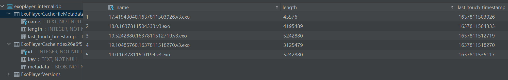

# Android JetPack Compose实现网络请求分页加载，ExoPlayer视频播放，无缝全屏播放| Compose 与 View的互相调用

最近几天一直在研究谷歌的JetPack Compose,给我最大的感受就是便捷，往往使用RecyclerView和Adapter需要实现的功能，包括自定义View,或者简单到一个View的自定义，代码比起Compose要多了很多。

自己尝试实现了一款视频列表播放Demo，代码还有很多需要优化的地方，目前只是实现了简单的效果。

      

### 一、分析

1. 网络请求与API:

   ​	   网络请求依然用retrofit, 视频列表API随便找一个即可，分页跟上次一样选用Paging3，个人感觉非常搭配Jetpack Compose


2. 视频播放器的选择：

   ​      播放器可以选用大名鼎鼎的 ijkplayer，我就用ExoPlayer,自己贴了个controller_view上去。


3. 横竖屏切换：

   ​    同一个PlayerView,全屏的时候 ,先从列表item中remove(),然后addView()给R.id.content ，竖屏反过来操作。

### 二、分页与网络请求：

1. ​    实例化Retrofit:

   ```kotlin
   object RetrofitClient {

       private val instance: Retrofit by lazy {

           val logInterceptor = HttpLoggingInterceptor()
           if (BuildConfig.DEBUG) {
           //显示日志
           logInterceptor.level = HttpLoggingInterceptor.Level.BODY
           } else {
               logInterceptor.level = HttpLoggingInterceptor.Level.NONE
           }

           val okhttpClient = OkHttpClient.Builder().addInterceptor(logInterceptor)
               .connectTimeout(5, TimeUnit.SECONDS)//设置超时时间
               .retryOnConnectionFailure(true).build()

           Retrofit.Builder()
               .client(okhttpClient)
               .baseUrl(BASE_URL)
               .addConverterFactory(GsonConverterFactory.create())
               .build()
       }

       fun <T> createApi(clazz: Class<T>): T {
           return instance.create(clazz) as T
       }
   }
   ```


2. 定义列表接口：

   ```kotlin
   interface VideoListService {

       @GET("api/v4/discovery/hot")
       suspend fun getVideoList(
           @Query("start") itemStart: Int = 1,
           @Query("num") pageSize: Int = 6
       ): VideoStore
   }
   ```

3. Paging分页逻辑在VideoListDataSource.kt完成：

   ```kotlin
   class VideoListDataSource(private val repository: Repository) : PagingSource<Int, VideoItem>() {

       private val TAG = "--ExamSource"

       override fun getRefreshKey(state: PagingState<Int, VideoItem>): Int? {
           return null
       }

       override suspend fun load(params: LoadParams<Int>): LoadResult<Int, VideoItem> {

           return try {
               val currentPage = params.key ?: 1
               val pageSize = params.loadSize

               // 每一页请求几条数据
               val everyPageSize = 4
               // 第一次初始请求，多加载一点
               val initPageSize = 8
               // 当前请求的起始位置，指起始下标
               val curStartItem =
                   if (currentPage == 1) 1 else (currentPage - 2) * everyPageSize + 1 + initPageSize

               val responseList = repository.getVideoList(curStartItem, pageSize = pageSize)
                   .videoList ?: emptyList<VideoItem>()
               // 上一页页码
               val preKey = if (currentPage == 1) null else currentPage.minus(1)
               // 下一页页码
               var nextKey: Int? = currentPage.plus(1)
               Log.d(TAG, "currentPage: $currentPage")
               Log.d(TAG, "preKey: $preKey")
               Log.d(TAG, "nextKey: $nextKey")
               if (responseList.isEmpty()) {
                   nextKey = null
               }

               LoadResult.Page(
                   data = responseList,
                   prevKey = preKey,
                   nextKey = nextKey
               )
           } catch (e: Exception) {
               e.printStackTrace()
               LoadResult.Error(e)
           }
       }
   }
   ```


4. 数据请求：Repository,

   > 谷歌之前推荐的架构库 **官方Android应用架构库（Architecture Components）**推荐将ViewModel中的网络请求数据库交互部分交给Repository来处理，而ViewModel专注于业务和UI交互，并等待Repository去拿网络数据，大部分应用不需要每次都请求新的页面数据，最好是缓存到本地。于是该架构推荐Room数据库作为本地缓存，这样是比较完美的，也就是请求完列表页面数据给Room, 页面绘制优先拿Room的数据。但是我这里没有考虑实现。

   ​

   ```kotlin
   object Repository {

       suspend fun getVideoList(itemStart: Int, pageSize: Int) =
           RetrofitClient.createApi(VideoListService::class.java)
               .getVideoList(itemStart, pageSize)
   }
   ```


5. ViewModel拿到数据：

   这里拿到是PagingData<T> 的流，被viewModel收集，需要传入协程作用域，Paging内部会安排发送流：

   ```kotlin
    /**
        * The actual job that collects the upstream.
        */
       private val job = scope.launch(start = CoroutineStart.LAZY) {
           src.withIndex()
               .collect {
                   mutableSharedSrc.emit(it)
                   pageController.record(it)
               }
       }.also {
           it.invokeOnCompletion {
               // Emit a final `null` message to the mutable shared flow.
               // Even though, this tryEmit might technically fail, it shouldn't because we have
               // unlimited buffer in the shared flow.
               mutableSharedSrc.tryEmit(null)
           }
       }
   ```


   ```kotlin
   val videoItemList = Pager(
           config = PagingConfig(
               pageSize = 4,
               initialLoadSize = 8, // 第一次加载数量
               prefetchDistance = 2,
           )
       ) {
           VideoListDataSource(Repository)
       }.flow.cachedIn(viewModelScope)
   ```


### 三、加载列表

 上面viewModel 我们得到Flow<PagingData<T>数据流，Compose提供了一种便捷加载LazyColumn(其实类似RecyclerView 只是用不着RecyclerAdapter)的方式：

```kotlin
/**
*从[PagingData]的[流]收集数据，将他们表现为一个[LazyPagingItems]实例。[LazyPagingItems]实例可以被[items]和[itemsIndexed]方法使用

*[LazyListScope]应该是个上下文作用域，使用它就是为了从[PagingData]的[Flow]流获取的数据能够被LazyColumn使用。大概是这个意思，总之就是方便开发者。
 *
 * @sample androidx.paging.compose.samples.PagingBackendSample
 */
@Composable
public fun <T : Any> Flow<PagingData<T>>.collectAsLazyPagingItems(): LazyPagingItems<T> {
    val lazyPagingItems = remember(this) { LazyPagingItems(this) }

    LaunchedEffect(lazyPagingItems) {
        lazyPagingItems.collectPagingData()
    }
    LaunchedEffect(lazyPagingItems) {
        lazyPagingItems.collectLoadState()
    }

    return lazyPagingItems
}
```

**列表实现：**

没有什么特别的地方，但是有一点需要注意：列表随着滑动，始终对顶部可见的Item做播放，所以需要判断列表中顶部可见的项。

LazyListState源码中有这样一个方法：

```kotlin
 /**
     * The index of the first item that is visible
     */
    val firstVisibleItemIndex: Int get() = scrollPosition.observableIndex
```

”可见的第一项的索引“ 就是第一项眼睛看到的Item索引


```kotlin
/**
 * 首页列表加载 ---普通加载，没有下拉刷新，可加载下一页
 * */

@Composable
fun NormalVideoListScreen(
    viewModel: MainViewModel,
    context: Context,
) {

    val collectAsLazyPagingIDataList = viewModel.videoItemList.collectAsLazyPagingItems()

    // 首次加载业务逻辑
    when (collectAsLazyPagingIDataList.loadState.refresh) {
        is LoadState.NotLoading -> {
            ContentInfoList(
                collectAsLazyPagingIDataList = collectAsLazyPagingIDataList,
                context = context,
                viewModel = viewModel
            )
        }
        is LoadState.Error -> ErrorPage() { collectAsLazyPagingIDataList.refresh() }
        is LoadState.Loading -> LoadingPageUI()
    }
}

@ExperimentalCoilApi
@Composable
fun ContentInfoList(
    context: Context,
    collectAsLazyPagingIDataList: LazyPagingItems<VideoItem>,
    viewModel: MainViewModel
) {
    val lazyListState = rememberLazyListState()
    val focusIndex by derivedStateOf { lazyListState.firstVisibleItemIndex }

    LazyColumn(
        state = lazyListState
    ) {
        itemsIndexed(collectAsLazyPagingIDataList) { index, videoItem ->
            // 传入列表卡片Item
            VideoCardItem(
                videoItem = videoItem!!,
                isFocused = index == focusIndex,
                onClick = { Toast.makeText(context, "ccc", Toast.LENGTH_SHORT).show() },
                index = index,
                viewModel = viewModel
            )
        }

        // 加载下一页业务逻辑
        when (collectAsLazyPagingIDataList.loadState.append) {
            is LoadState.NotLoading -> {
                itemsIndexed(collectAsLazyPagingIDataList) { index, videoItem ->
                    VideoCardItem(
                        videoItem = videoItem!!,
                        isFocused = index == focusIndex,
                        onClick = { Toast.makeText(context, "ccc", Toast.LENGTH_SHORT).show() },
                        index = index,
                        viewModel = viewModel
                    )
                }
            }
            is LoadState.Error -> item {
                NextPageLoadError {
                    collectAsLazyPagingIDataList.retry()
                }
            }
            LoadState.Loading -> item {
                LoadingPageUI()
            }
        }
    }
}


/**
 * 页面加载失败重试
 * */
@Composable
fun ErrorPage(onclick: () -> Unit = {}) {
    Column(
        modifier = Modifier.fillMaxSize(),
        verticalArrangement = Arrangement.Center,
        horizontalAlignment = Alignment.CenterHorizontally
    ) {
        Image(
            modifier = Modifier.size(219.dp, 119.dp),
            painter = painterResource(id = R.drawable.ic_default_empty),
            contentDescription = "网络问题",
            contentScale = ContentScale.Crop
        )
        Button(
            modifier = Modifier.padding(8.dp),
            onClick = onclick,
        ) {
            Text(text = "网络不佳，请点击重试")
        }
    }
}

/**
 * 加载中动效
 * */
@Composable
fun LoadingPageUI() {
    Box(
        modifier = Modifier
            .fillMaxSize()
            .padding(170.dp), contentAlignment = Alignment.Center
    ) {
        val animator by rememberInfiniteTransition().animateFloat(
            initialValue = 0f,
            targetValue = 360f,
            animationSpec = infiniteRepeatable(
                tween(800, easing = LinearEasing),
                repeatMode = RepeatMode.Restart
            )
        )
        Canvas(modifier = Modifier.fillMaxSize()) {
            translate(80f, 80f) {
                drawArc(
                    color = RedPink,
                    startAngle = 0f,
                    sweepAngle = animator,
                    useCenter = false,
                    size = Size(80 * 2f, 80 * 2f),
                    style = Stroke(12f),
                    alpha = 0.6f,
                )
            }
        }
    }
}

/**
 * 加载下一页失败
 * */
@Composable
fun NextPageLoadError(onClick: () -> Unit) {
    Row(
        modifier = Modifier
            .fillMaxWidth()
            .padding(8.dp),
        verticalAlignment = Alignment.CenterVertically,
        horizontalArrangement = Arrangement.Center,
    ) {
        Button(onClick = onClick) {
            Text(text = "重试")
        }
    }
}
```


**四、列表的Item**

Item中需要嵌入播放器，由于播放器和布局是java代码写的，所以涉及两者相互调用。


LaunchedEffect：利用它，我们可以在@Compose中使用协程，官方文档是这么描述的：

<u>*要在可组合函数中安全地调用挂起函数，请使用launchedeeffect可组合函数。当launchedeeffect进入Composition时，它会启动一个协程，并将代码块作为参数传递。如果LaunchedEffect离开组合，协程将被取消*。</u>


先看布局代码：

分为上面的文案描述和播放器部分，这里我通过判断:

```
 if(当前item的下标 == 第一个可见Item的下标){
      布局播放器并preper
}else{

      贴一张视频封面占位
}
```

1. 卡片上面的文字和封面部分：

```kotlin
@ExperimentalCoilApi
@Composable
fun VideoCardItem(
    videoItem: VideoItem,
    isFocused: Boolean,
    onClick: () -> Unit,
    index: Int,
    viewModel: MainViewModel?
) {
    val videoInfo = videoItem.videoInfo
    Card(
        modifier = Modifier
            .fillMaxWidth()
            .padding(start = 5.dp, top = 5.dp, end = 5.dp, bottom = 5.dp),
        shape = RoundedCornerShape(10.dp),
        elevation = 8.dp,
        backgroundColor = if (isFocused) gray300 else MaterialTheme.colors.surface
    ) {
        Column(
            modifier = Modifier.padding(16.dp)
        ) {

            Text(
                text = "$index: ${videoInfo?.description}",
                style = MaterialTheme.typography.h6
            )
            Text(
                modifier = Modifier.padding(top = 8.dp),
                text = videoInfo?.title ?: "",
                style = MaterialTheme.typography.body1,
                color = gray600
            )
            var width = 1280
            var height = 720
            videoInfo?.playInfo?.let {
                if (it.isNotEmpty()) {
                    width = it[0].width
                    height = it[0].height
                }
            }
            if (isFocused) {
                ExoPlayerView(isFocused, videoInfo, viewModel)
            } else {
                // 截断以下图片Url
                val coverUrl = videoInfo?.cover?.feed?.substringBefore('?')
                CoilImage(
                    url = coverUrl,
                    modifier = Modifier
                        .aspectRatio(width.toFloat() / height)
                        .fillMaxWidth()
                )
            }
        }
    }
}
```


2. 播放器部分，需要在Compose调用Android SDK的UI逻辑，俗称Compose调用Android:

```kotlin
@ExperimentalCoilApi
@Composable
fun ExoPlayerView(isFocused: Boolean, videoInfo: VideoInfo?, viewModel: MainViewModel?) {

    val context = LocalContext.current
    // 获取播放器实例
    val exoPlayer = remember { ExoPlayerHolder.get(context = context) }
    var playerView: MyPlayerView? = null

    var width = 1280
    var height = 720
    videoInfo?.playInfo?.let {
        if (it.isNotEmpty()) {
            width = it[0].width
            height = it[0].height
        }
    }

    if (isFocused) {
        videoInfo?.let {
            LaunchedEffect(key1 = videoInfo.playUrl, key2 = it) {
                val playUri = Uri.parse(it.playUrl)
                val dataSourceFactory = VideoDataSourceHolder.getCacheFactory(context)
                val mediaSource = when (Util.inferContentType(playUri)) {
                    C.TYPE_DASH -> DashMediaSource.Factory(dataSourceFactory)
                        .createMediaSource(MediaItem.fromUri(playUri))
                    C.TYPE_HLS -> HlsMediaSource.Factory(dataSourceFactory)
                        .createMediaSource(MediaItem.fromUri(playUri))
                    else -> ProgressiveMediaSource.Factory(dataSourceFactory)
                        .createMediaSource(MediaItem.fromUri(playUri))
                }

                exoPlayer.setMediaSource(mediaSource)
                exoPlayer.prepare()
            }
        }
        // Compose中使用传统Android View ，谷歌文档有这样的描述：
        /**
         *你可以在Compose UI中包含一个Android View层次结构。如果你想使用在Compose中还不能使用的UI元素，比如AdView或              * MapView，这种方法特别有用。这种方法还允许重用您设计的自定义视图。要包含视图元素或层次结构，请使用AndroidView可组          * 合。AndroidView被传递一个lambda，返回一个View。AndroidView还提供了一个更新回调函数，当视图膨胀时调用它。每当在          * 回调中读取State时，AndroidView就会重新组合。
        */

        AndroidView(
            modifier = Modifier.aspectRatio(width.toFloat() / height),
            factory = { context ->
                 // 创建你需要的ViewGroup 或者 View
                val frameLayout = FrameLayout(context)
                frameLayout.setBackgroundColor(context.getColor(android.R.color.holo_purple))
                frameLayout
            },
            update = { frameLayout ->
                // 假如你定义了状态，则状态发生改变或者它的父节点状态改变，这里都会重建
                logD("update removeAllViews, playerViewMode: ${PlayerViewManager.playerViewMode}, isFocused:$isFocused")
                if (PlayerViewManager.playerViewMode == PlayViewMode.HALF_SCREEN) {
                    frameLayout.removeAllViews()
                    if (isFocused) {
                        playerView = PlayerViewManager.get(frameLayout.context)

                        // 切换播放器
                        MyPlayerView.switchTargetView(
                            exoPlayer,
                            PlayerViewManager.currentPlayerView,
                            playerView
                        )
                        PlayerViewManager.currentPlayerView = playerView

                        playerView?.apply {
                            player?.playWhenReady = true
                        }

                        playerView?.apply {
                            (parent as? ViewGroup)?.removeView(this)
                        }
                        frameLayout.addView(
                            playerView,
                            FrameLayout.LayoutParams.MATCH_PARENT,
                            FrameLayout.LayoutParams.MATCH_PARENT
                        )
                        viewModel?.saveFrameLayout(frameLayout)
                        logD("update, frameLayout:$frameLayout")
                    } else if (playerView != null) {
                        playerView?.apply {
                            (parent as? ViewGroup)?.removeView(this)
                            PlayerViewManager.release(this)
                        }
                        playerView = null
                    }
                }
            }
        )

        DisposableEffect(key1 = videoInfo?.playUrl) {
            onDispose {
                logD("--onDispose, isFocused: $isFocused")
                if (isFocused) {
                    playerView?.apply {
                        (parent as? ViewGroup)?.removeView(this)
                    }
                    exoPlayer.stop()
                    playerView?.let {
                        PlayerViewManager.release(it)
                    }
                    playerView = null
                }
            }
        }
    }
}
```


3. 那么传统Android如何调用Compose呢？

   代码或者xml中，Fragment中都可以使用Compose,如果是在代码中，假设前面的视频封面把他写在上面的方法中，就可以这么写：

   ```
   if (isFocused) {
      // ....
   }else{
      // 这里是Compose中插入Android View
      AndroidView(
              modifier = Modifier.aspectRatio(width.toFloat() / height),
              factory = { context ->
                  val coverLayout = FrameLayout(context)
                  coverLayout.setBackgroundColor(context.getColor(android.R.color.darker_gray))
                  coverLayout
              },
              update = { coverLayout ->
                  val coverUrl = videoInfo?.cover?.feed?.substringBefore('?')
                  // 这里在Android View中插入Compose,使用ComposeView
                  coverLayout.addView(ComposeView(context).apply {
                      // 这个id需要注册在res/values/ids.xml文件中
                      id = R.id.compose_view_cover
                      setContent {
                          MaterialTheme {
                              CoilImage(
                                  url = coverUrl,
                                  modifier = Modifier.fillMaxWidth()
                              )
                          }
                      }
                  })
              }
           )
   }
   ```


4. Android View与Compose调用其实还有很多，我了解也不多。下面再说说播放器逻辑：

   播放器布局就用了exo自带的PlayerView，添加了一个自己的player_controller_layout.xml

   ```xml
   <?xml version="1.0" encoding="utf-8"?>
   <com.google.android.exoplayer2.ui.MyPlayerView xmlns:android="http://schemas.android.com/apk/res/android"
       xmlns:app="http://schemas.android.com/apk/res-auto"
       android:id="@+id/playerView"
       android:layout_width="match_parent"
       android:layout_height="match_parent"
       android:layout_gravity="center"
       android:minHeight="200dp"
       app:keep_content_on_player_reset="false"
       app:resize_mode="fixed_width"
       app:show_buffering="when_playing"
       app:shutter_background_color="@android:color/black"
       app:surface_type="surface_view"
       app:use_controller="true"
       app:controller_layout_id="@layout/player_controller_layout" />
   ```


五、exoPlayer播放器：

1. 播放器创建：

​

```kotlin
/**
 * 播放器实例创建
 * */
object ExoPlayerHolder {
    private var exoplayer: SimpleExoPlayer? = null

    fun get(context: Context): SimpleExoPlayer {
        if (exoplayer == null) {
            exoplayer = createExoPlayer(context)
        }
        exoplayer!!.addListener(object : Player.Listener {
            override fun onPlayerError(error: PlaybackException) {
                super.onPlayerError(error)
                Toast.makeText(context, error.message, Toast.LENGTH_SHORT).show()
                logD("onPlayerError：${error.errorCode} ,${error.message}")
            }

            override fun onVideoSizeChanged(videoSize: VideoSize) {
                super.onVideoSizeChanged(videoSize)
                logD("onVideoSizeChanged：${videoSize.width} x ${videoSize.height} | ratio: ${videoSize.pixelWidthHeightRatio}")
            }

            override fun onSurfaceSizeChanged(width: Int, height: Int) {
                super.onSurfaceSizeChanged(width, height)
                logD("onSurfaceSizeChanged：$width x $height")
            }
        })
        return exoplayer!!
    }

    // 创建ExoPlayer实例
    private fun createExoPlayer(context: Context): SimpleExoPlayer {
        return SimpleExoPlayer.Builder(context)
            .setLoadControl(
                DefaultLoadControl.Builder().setBufferDurationsMs(
                    // 设置预加载上限下限
                    DefaultLoadControl.DEFAULT_MIN_BUFFER_MS,
                    DefaultLoadControl.DEFAULT_MAX_BUFFER_MS,
                    DefaultLoadControl.DEFAULT_BUFFER_FOR_PLAYBACK_MS / 10,
                    DefaultLoadControl.DEFAULT_BUFFER_FOR_PLAYBACK_AFTER_REBUFFER_MS / 10
                ).build()
            )
            .build()
            .apply {
                // 播放模式，设置为不重复播放
                repeatMode = Player.REPEAT_MODE_ONE
            }
    }
}
```

2. 实例化PlayerView:

   PlayerViewManager.kt

   这里用到了androidx.core.util.Pools工具，他是个对象池，复用对象池中的对象，可以避免频繁创建和销毁堆中的对， 进而减少垃圾收集器的负担。设置为2就够用了，acquire()先获取对象，如果没有获取到就创建，使用完后release()即归还给对象池。
   对象池： https://www.jianshu.com/p/eb04e4e1869d

```kotlin
/**
 * 用来管理 PlayerView
 * */
object PlayerViewManager : ExoEventListener {

    var currentPlayerView: MyPlayerView? = null

    var playerViewMode = PlayViewMode.HALF_SCREEN
    var activity: MainActivity? = null
    var viewModel: MainViewModel? = null

    private val playerViewPool = Pools.SimplePool<MyPlayerView>(2)

    fun get(context: Context): MyPlayerView {
        return playerViewPool.acquire() ?: createPlayerView(context)
    }

    fun release(player: MyPlayerView) {
        playerViewPool.release(player)
    }

    /**
     * 创建PlayerView
     * */
    private fun createPlayerView(context: Context): MyPlayerView {
        val playView = (LayoutInflater.from(context)
            .inflate(R.layout.exoplayer_texture_view, null, false) as MyPlayerView)
        playView.setShowMultiWindowTimeBar(true)
        playView.setShowBuffering(MyPlayerView.SHOW_BUFFERING_ALWAYS)
        playView.controllerAutoShow = true
        playView.playerController.setExoEventListener(this)

        initOther(playView)
        return playView
    }
}
```

3. 缓存设置与缓存策略：

   

```kotlin
/**
 * 缓存基本设置，exo内部会提供一个命名 exoplayer_internal.db 的数据库作为缓存
 * */
object CacheHolder {
    private var cache: SimpleCache? = null
    private val lock = Object()

    fun get(context: Context): SimpleCache {
        synchronized(lock) {
            if (cache == null) {
                val cacheSize = 20L * 1024 * 1024
                val exoDatabaseProvider = ExoDatabaseProvider(context)

                cache = SimpleCache(
                    // 缓存文件地址
                    context.cacheDir,
                    // 释放上次的缓存数据
                    LeastRecentlyUsedCacheEvictor(cacheSize),
                    // 提供数据库
                    exoDatabaseProvider
                )
            }
        }
        return cache!!
    }
}

/**
 * 设置缓存策略
 * */
object VideoDataSourceHolder {
    private var cacheDataSourceFactory: CacheDataSource.Factory? = null
    private var defaultDataSourceFactory: DataSource.Factory? = null

    fun getCacheFactory(context: Context): CacheDataSource.Factory {
        if (cacheDataSourceFactory == null) {
            val simpleCache = CacheHolder.get(context)
            val defaultFactory = getDefaultFactory(context)
            cacheDataSourceFactory = CacheDataSource.Factory()
                .setCache(simpleCache)
                // 设置Uri协议相关参数，用来从缓存做读取操作
                .setUpstreamDataSourceFactory(defaultFactory)
                // 设置CacheDataSource工厂类型，用来读取缓存
                .setCacheReadDataSourceFactory(FileDataSource.Factory())
                // 缓存写入设置
                .setCacheWriteDataSinkFactory(
                    CacheDataSink.Factory()
                        .setCache(simpleCache)
                        .setFragmentSize(CacheDataSink.DEFAULT_FRAGMENT_SIZE)
                )
        }

        return cacheDataSourceFactory!!
    }

    private fun getDefaultFactory(context: Context): DataSource.Factory {
        if (defaultDataSourceFactory == null) {
            defaultDataSourceFactory = DefaultDataSourceFactory(
                context,
                Util.getUserAgent(context, context.packageName)
            )
        }
        return defaultDataSourceFactory!!
    }

}
```


**附录：状态栏管理**

* 实例化WindowInsetsController:
val controller = ViewCompat.getWindowInsetsController(view)

* 控制状态栏
   * 显示状态栏：
    `controller?.show(WindowInsetsCompat.Type.statusBars())`

   * 隐藏状态栏：
     `controller?.hide(WindowInsetsCompat.Type.statusBars())`

   * 状态栏文字颜色改为黑色：
      `controller?.isAppearanceLightStatusBars = true`

   * 状态栏文字颜色改为白色：
      `controller?.isAppearanceLightStatusBars = false`
* 控制导航栏
   * 显示
      `controller?.show(WindowInsetsCompat.Type.navigationBars())`
   * 隐藏
       `controller?.hide(WindowInsetsCompat.Type.navigationBars())`

* 导航栏隐藏时手势操作
controller?.systemBarsBehavior = WindowInsetsControllerCompat.BEHAVIOR_SHOW_TRANSIENT_BARS_BY_SWIPE
   * systemBarsBehavior有三个值：
        BEHAVIOR_SHOW_BARS_BY_SWIPE
        BEHAVIOR_SHOW_BARS_BY_TOUCH
        BEHAVIOR_SHOW_TRANSIENT_BARS_BY_SWIPE
* 控件键盘
(需要界面有EditText并且EditText获取到焦点才能起作用)

   * 显示键盘
    `controller?.show(WindowInsetsCompat.Type.ime())`
   * 隐藏键盘
    `controller?.hide(WindowInsetsCompat.Type.ime())`

* 操作所有系统栏
    * 全屏显示：
     `controller?.hide(WindowInsetsCompat.Type.systemBars())`
    * 显示其他系统栏:
     `controller?.show(WindowInsetsCompat.Type.systemBars())`